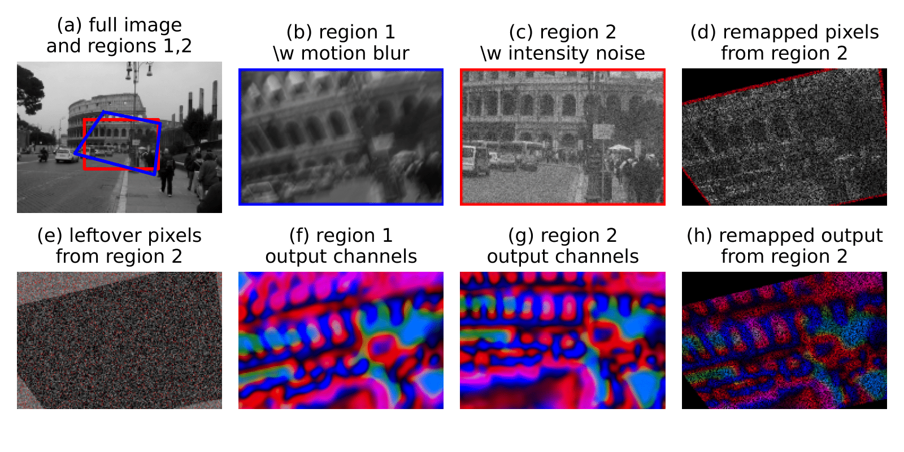

# Aligning Blurry Images via Overcomplete Pixels



This repository contains tutorial-style code for reproducing the main image alignment results from our preprint [Aligning Motion-Blurred Images Using Contrastive Learning on Overcomplete Pixels](https://arxiv.org/abs/2410.07410). 

*TLDR*: We propose a new contrastive objective for learning overcomplete pixel-level features that are invariant to motion blur. Other invariances (e.g., pose, illumination, or weather) can be learned by applying the corresponding transformations on unlabeled images during self-supervised training. The details of the method are described in our preprint:

Pogorelyuk, L., & Radev, S. T. (2024).
Aligning Motion-Blurred Images Using Contrastive Learning on Overcomplete Pixels. 
<em>arXiv preprint arXiv:2410.07410</em>, available for free at: https://arxiv.org/abs/2410.07410

## Cite

```bibtex
@article{pogorelyuk2024aligning,
  title={Aligning Motion-Blurred Images Using Contrastive Learning on Overcomplete Pixels},
  author={Pogorelyuk, Leonid and Radev, Stefan T},
  journal={arXiv preprint arXiv:2410.07410},
  year={2024}
}
```

## [Demo notebook](demo)

The provided [tutorial notebook](demo/tutorial_notebook.ipynb) is self-contained and relies on a pre-trained U-Net architecture as a feature extractor.

## License

MIT